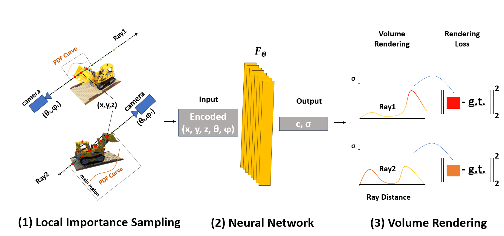

# L-NeRF(L-NeRF: Local Importance Sampling for Enhanced Neural Radiance Fields)
<!--
[NeRF](http://www.matthewtancik.com/nerf) (Neural Radiance Fields) is a method that achieves state-of-the-art results for synthesizing novel views of complex scenes. Here are some videos generated by this repository (pre-trained models are provided below):


-->
This project proposes a novel strategy
utilizing local importance sampling, denoted as L-NeRF. Contrary to traditional NeRF sampling that spans
the entire ray, L-NeRF excludes low-weight, uniformly sampled points sampled in ray extremities or noisy
areas and importance sampling is concentrated in areas with significant weights, disregarding low-weight
point distribution.

This project improves the clarity of surface
details and significantly surpasses traditional NeRF(Nerf-pytorch) in view synthesis quality. Moreover, L-NeRF
accentuates the demarcation between the rendered model and the scene, enhancing visual perception and
facilitating the segmentation of key objects for further research. Compared to the original NeRF model,
this method enhances rendering quality by approximately 10% while reducing training time by nearly 25%. 

## Installation

```
git clone https://github.com/lifeixiao/L-NeRF.git
cd L-NeRF
pip install -r requirements.txt
```

<details>
  <summary> Dependencies (click to expand) </summary>
  
  ## Dependencies
  - PyTorch 1.12
  - matplotlib
  - numpy
  - imageio
  - imageio-ffmpeg
  - configargparse
  
The LLFF data loader requires ImageMagick.

You will also need the [LLFF code](http://github.com/fyusion/llff) (and COLMAP) set up to compute poses if you want to run on your own real data.
  
</details>

## How To Run?

### Quick Start

Download data for two example datasets: `lego` and `fern`
```
bash download_example_data.sh
```

To train a low-res `lego` NeRF:
```
python run_nerf.py --config configs/lego.txt --threshold 0.0
```
<!--
After training for 100k iterations (~4 hours on a single 2080 Ti), you can find the following video at `logs/lego_test/lego_test_spiral_100000_rgb.mp4`.


---
-->

To train a low-res `fern` NeRF:
```
python run_nerf.py --config configs/fern.txt --threshold 0.0
```
<!--
After training for 200k iterations (~8 hours on a single 2080 Ti), you can find the following video at `logs/fern_test/fern_test_spiral_200000_rgb.mp4` and `logs/fern_test/fern_test_spiral_200000_disp.mp4`


---
-->
### More Datasets
To play with other scenes presented in the paper, download the data [here](https://drive.google.com/drive/folders/128yBriW1IG_3NJ5Rp7APSTZsJqdJdfc1). Place the downloaded dataset according to the following directory structure:
```
├── configs                                                                                                       
│   ├── ...                                                                                     
│                                                                                               
├── data                                                                                                                                                                                                       
│   ├── nerf_llff_data                                                                                                  
│   │   └── fern                                                                                                                             
│   │   └── flower  # downloaded llff dataset                                                                                  
│   │   └── horns   # downloaded llff dataset
|   |   └── ...
|   ├── nerf_synthetic
|   |   └── lego
|   |   └── ship    # downloaded synthetic dataset
|   |   └── ...
```

---

To train NeRF on different datasets: 

```
python run_nerf.py --config configs/{DATASET}.txt --threshold {float number}
```
replace `{DATASET}` with `trex` | `horns` | `flower` | `fortress` | `lego` | etc.

All the thresholds of the datasets are default set 0.0, if you want to set by yourself ,

you can add arguments and than train, an example is:

```
python run_nerf.py --config configs/{DATASET}.txt --threshold 0.0
```

or you can change the configs files, and change the thresholds, for example,
you can add ``` threshold = 0.001 ``` in the bottom of the configs files.


---

To test NeRF trained on different datasets: 

```
python run_nerf.py --config configs/{DATASET}.txt --threshold {float number} --render_only
```

replace `{DATASET}` with `trex` | `horns` | `flower` | `fortress` | `lego` | etc.

### Reproducibility 

Tests that ensure the results of all functions and training loop match the official implentation are contained in a different branch `reproduce`. One can check it out and run the tests:
```
git checkout reproduce
py.test
```

## Method


  


>L-NeRF, which improves the model details by performing weighted sampling in the region with a high weight of uniformly sampled points, instead of importance sampling along the entire ray.
>This approach allows us to increase the model's level of detail while reducing the sampling count by approximately 30\% and decreasing the training time by about 25\% compared to the original NeRF model.


## Citation
Kudos to the authors for their amazing results:
```
@misc{mildenhall2020nerf,
    title={NeRF: Representing Scenes as Neural Radiance Fields for View Synthesis},
    author={Ben Mildenhall and Pratul P. Srinivasan and Matthew Tancik and Jonathan T. Barron and Ravi Ramamoorthi and Ren Ng},
    year={2020},
    eprint={2003.08934},
    archivePrefix={arXiv},
    primaryClass={cs.CV}
}
```
Our code is mostly based on the following code:
```
@misc{lin2020nerfpytorch,
  title={NeRF-pytorch},
  author={Yen-Chen, Lin},
  publisher = {GitHub},
  journal = {GitHub repository},
  howpublished={\url{https://github.com/yenchenlin/nerf-pytorch/}},
  year={2020}
}
```

However, if you find this implementation or method helpful, please consider to cite:
```
@misc{xiao2024L-NeRF,
  title={L=NeRF},
  author={lifei Xiao},
  publisher={Github},
  journal = {GitHub repository},
  howpublished={\url{https://github.com/lifeixiao/L-NeRF/}},
  year={2024}
}
```

